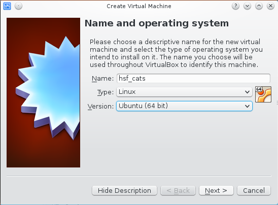
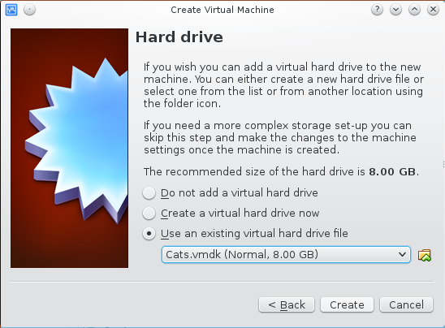
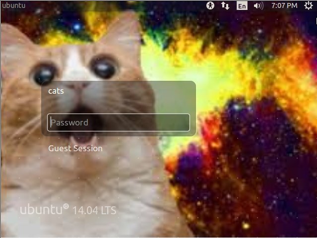
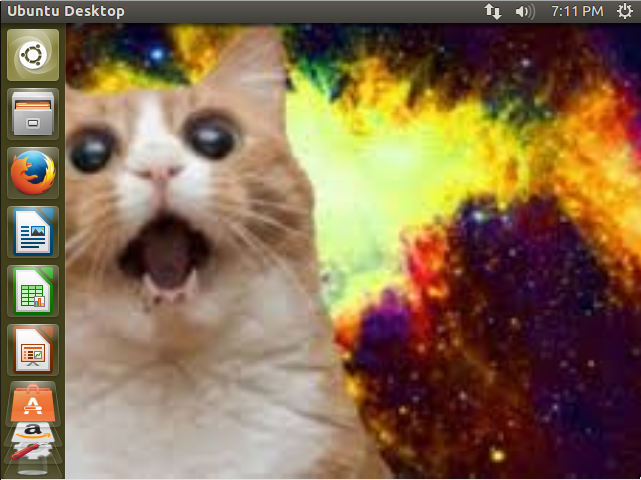
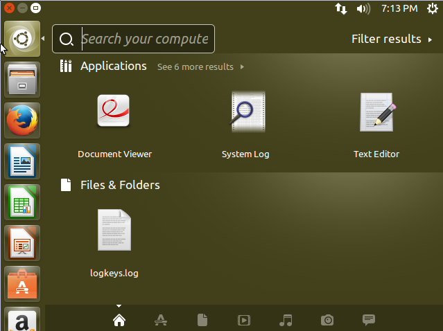
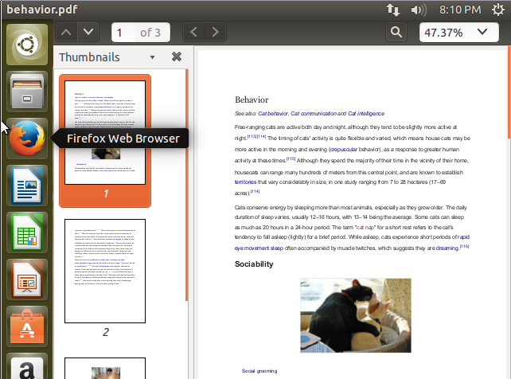
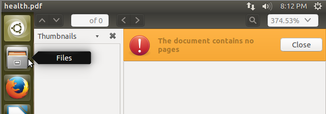
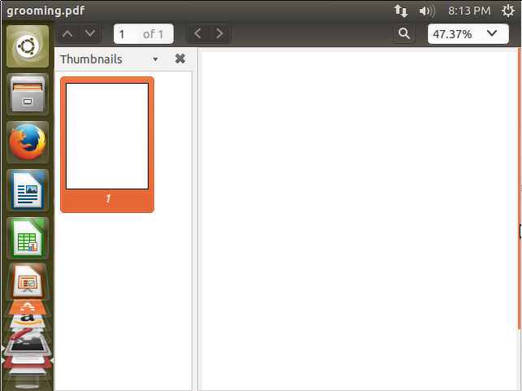
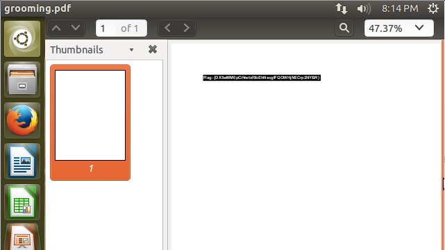
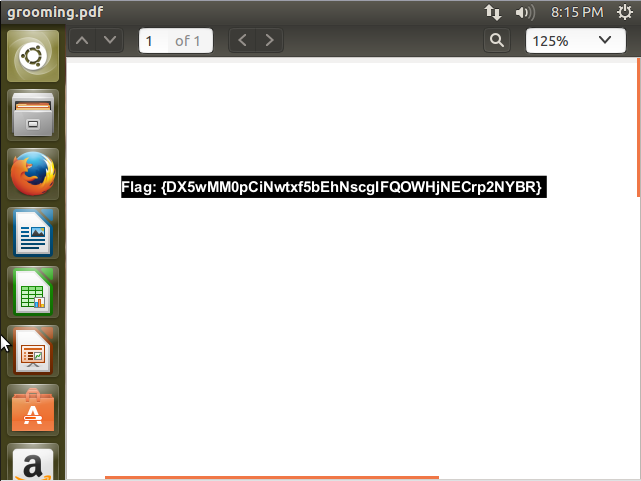

# Cats
This is team The Deductive Fuzzyhashers' writeup of the problem Cats from CSAW HSF 2015.

## Problem
We were given a ZIP file which contained eight files:

* Cats.nvram
* Cats.vmdk
* Cats.vmsd
* Cats.vmx
* Cats.vmxf
* vmware-0.log
* vmware-1.log
* vmware.log

The description of the problem was: "Hint: I had fun once, it was horrible. Password: F3lyn34LifE!"

## Process
The first step we took was to boot up the cats virtual machine. We used VirtualBox, but VMWare (which the VM appears to originally be from) or other emulation systems would also work.

At this point, we assumed all that was relevant to the challenge was the .vmdk file (the .vmdk is the hard disk file for VMWare machines). We created a new virtual machine in VirtualBox:




And attached Cats.vmdk as the main hard drive:



We then powered up the machine in VirtualBox. At first boot, we were greeted with this Ubuntu login screen:



We logged in with the password which was provided to us in the challenge description, `F3lyn34LifE!`. We were greeted by a standard Ubuntu Desktop:



The first thing we did was click on the Unity icon to bring up the Unity menu. We noticed that in the Files & Folders section, there was a recently opened file called "`logkeys.log`":



We right clicked the file entry and clicked "Show in Folder", which opened the Ubuntu file browser in `/var/log` and highlighted `logkeys.log`. This told us that the file `/var/log/logkeys.log` was opened recently in the Ubuntu desktop. The name seemed indicative of a keylogger, and sure enough [logkeys](https://github.com/kernc/logkeys) is a project which is designed to log key presses on a computer to a file. At this point we opened `/var/log/logkeys.log` in the Terminal. The contents of `/var/log/logkeys.log` are below:

```
sudo apt-get install build-essential
wget https://logkeys.googlecode.com/files/logkeys-.01.1a.tar.gz
wget https://logkeys.googlecode.com/files/logkeys-0.1.1a.tar.gz
tar xvzf logkeys-0.1.1a.tar.gz
cd logkeys-0.1.1a/
./configure
make
sudo make install
sudo locale-gen
sudo logkeys -s
sudo gedit ~/.bash_history
cler
clear
veracrypt -t -c
1
/home/cats/catz
128 M
1
2
2
Me0wL3tMeInPl$
Me0wL3tMeInPl$
vyiivyiviparapvraivpyvyrivfyipefiyewyfwvpfiyewvfhnfzslc hvbhawbvklvhbsizbc awhbvua vawenvlfjvba;i vaw;vil;Vbhifvbahvbairk  iwbf irfirryarlhbvlhb ldbdkbvldv hbvhliebalkjverssnsnsr fefj g;ergp; gresgnlsbknbktjsnbkjtnkbjntsjrknblksnljsnb;ojrne orgse;go;egut;siggtibsi lknageosr;gnkjfd,n;ajrngout;fgnbseijrb f,nbs;efvmb gser
```

Another interesting file we found was `/home/cats/.bash_history~`, which seemed to be some sort of copy of `/home/cats/.bash_history` (which was empty and had likely been truncated). The file didn't turn out to be needed, but did help to point to `veracrypt` being used to encrypt a volume at `/home/cats/catz`. The file is available [here](450a-cats/.bash_history~):

From the `logkeys.log` file, we could tell that the `veracrypt` program (which is a free disk encryption program based on TrueCrypt) was used to create an encrypted volume. From the output of `veracrypt --help`:

```
Usage: veracrypt [--auto-mount <str>] [--backup-headers] [--background-task] [-C] [-c] [--create-keyfile] [--delete-token-keyfiles] [-d] [--display-password] [--encryption <str>] [--explore] [--export-token-keyfile] [--filesystem <str>] [-f] [--fs-options <str>] [--hash <str>] [-h] [--import-token-keyfiles] [-k <str>] [-l] [--list-token-keyfiles] [--load-preferences] [--mount] [-m <str>] [--new-hash <str>] [--new-keyfiles <str>] [--new-password <str>] [--new-pim <str>] [--non-interactive] [--stdin] [-p <str>] [--pim <str>] [--protect-hidden <str>] [--protection-hash <str>] [--protection-keyfiles <str>] [--protection-password <str>] [--protection-pim <str>] [--random-source <str>] [--restore-headers] [--save-preferences] [--quick] [--size <str>] [--slot <str>] [-tc] [--test] [-t] [--token-lib <str>] [-v] [--version] [--volume-properties] [--volume-type <str>] [Volume path] [Mount point]

  -c, --create                  Create new volume
  -t, --text                    Use text user interface
```

The option `-t` told `veracrypt` to use the text interface, instead of launching its graphical interface. The `-c` option told `veracrypt` to create an encrypted volume. On our own computer, we ran `veracrypt -t -c` to see what the lines after `veracrypt -t -c` in `/var/log/logkeys.log` might mean (as we assumed they were arguments passed to `veracrypt` while creating a volume):

```
samuel@samaritan ~ % veracrypt -t -c
Volume type:
 1) Normal
 2) Hidden
Select [1]: 1

Enter volume path: /home/cats/catz

Enter volume size (sizeK/size[M]/sizeG): 128 M

Encryption Algorithm:
 1) AES
 2) Serpent
 3) Twofish
 4) AES(Twofish)
 5) AES(Twofish(Serpent))
 6) Serpent(AES)
 7) Serpent(Twofish(AES))
 8) Twofish(Serpent)
Select [1]: 1

Hash algorithm:
 1) SHA-512
 2) Whirlpool
 3) SHA-256
Select [1]: 2

Filesystem:
 1) None
 2) FAT
 3) Linux Ext2
 4) Linux Ext3
 5) Linux Ext4
 6) NTFS
Select [2]: 2

Enter password: 
Re-enter password: 

Enter PIM: 

Enter keyfile path [none]: 

Please type at least 320 randomly chosen characters and then press Enter:
```

From this process, we determined what the remaining lines in `/var/log/logkeys.log` were:

* `1` was the volume type (normal)
* `/home/cats/catz` was the path to the `veracrypt` volume
* `128 M` was the size of the volume being created
* `1` was the encryption algorithm for the volume (AES)
* `2` was the hash algorithm for the volume (Whirlpool)
* `2` was the Filesystem type for the volume being created (FAT)
* `Me0wL3tMeInPl$` was the password for the volume being created
* The second `Me0wL3tMeInPl$` was the confirmation of the password for the volume being created
* `vyiivyiviparapvraivpyvyrivfyipefiyewyfwvpfiyewvfhnfzslc hvbhawbvklvhbsizbc awhbvua vawenvlfjvba;i vaw;vil;Vbhifvbahvbairk  iwbf irfirryarlhbvlhb ldbdkbvldv hbvhliebalkjverssnsnsr fefj g;ergp; gresgnlsbknbktjsnbkjtnkbjntsjrknblksnljsnb;ojrne orgse;go;egut;siggtibsi lknageosr;gnkjfd,n;ajrngout;fgnbseijrb f,nbs;efvmb gser` were random characters for `veracrypt`'s use in creating the volume.

Now that we had both the path to the created volume (`/home/cats/catz`) and the password for the volume (`Me0wL3tMeInPl$`), we used `veracrypt` to decrypt the volume:

```
cats@ubuntu:~$ veracrypt -t /home/cats/catz
Enter mount directory [default]: 
Enter password for /home/cats/catz: 
Enter keyfile [none]: 
Protect hidden volume (if any)? (y=Yes/n=No) [No]: 
Enter your user password or administrator password:

```

This mounted the decrypted volume at `/media/veracrypt1`. Running `ls -la` inside this directory showed 5 files or folders:

```
cats@ubuntu:/media/veracrypt1$ ls -la
total 12
[...]
-rwx------ 1 cats cats  385 Sep 11 13:20 .bash_history
drwx------ 4 cats cats 1024 Sep 11 08:45 .cache
drwx------ 2 cats cats 2048 Sep 11 13:19 CATZZZ
drwx------ 4 cats cats 1024 Sep 12 12:25 .config
drwx------ 3 cats cats 1024 Sep 11 08:45 .local
```

Inside the folder `CATZZZ` were several `.pdf` and `.jpg` files:

```
cats@ubuntu:/media/veracrypt1/CATZZZ$ ls -l
total 941
-rwx------ 1 cats cats 141662 Sep 11 08:42 anatomy.pdf
-rwx------ 1 cats cats 163211 Sep 11 08:46 behavior.pdf
-rwx------ 1 cats cats   8170 Sep 11 08:47 cat2.jpg
-rwx------ 1 cats cats   6699 Sep 11 08:47 cat3.jpg
-rwx------ 1 cats cats   5541 Sep 11 08:47 cat4.jpg
-rwx------ 1 cats cats   4093 Sep 11 08:47 cat5.jpg
-rwx------ 1 cats cats   5695 Sep 11 08:48 cat6.jpg
-rwx------ 1 cats cats   9223 Sep 11 08:47 cat.jpg
-rwx------ 1 cats cats  24817 Sep 11 08:50 grooming.pdf
-rwx------ 1 cats cats  61440 Sep 11 08:45 health.pdf
-rwx------ 1 cats cats  91011 Sep 11 08:46 Historyandmythology (1).pdf
-rwx------ 1 cats cats 127064 Sep 11 08:41 Historyandmythology.pdf
-rwx------ 1 cats cats  98613 Sep 11 08:42 physiology.pdf
-rwx------ 1 cats cats  95874 Sep 11 08:44 poisoning.pdf
-rwx------ 1 cats cats 112960 Sep 11 08:45 senses.pdf
```

While `/media/veracrypt1/.bash_history` did not reveal any information we did not already know (it contained several `veracrypt` commands used to mount the `catz` volume), `.bash_history` is not the only file which contains information about commands which have been run on Ubuntu systems. Another good place to look is `.local/share/recently-used.xml` which shows recently run commands. In this case, we looked at `.local/share/recently-used.xml` inside of the volume:

```
<?xml version="1.0" encoding="UTF-8"?>
<xbel version="1.0"
      xmlns:bookmark="http://www.freedesktop.org/standards/desktop-bookmarks"
      xmlns:mime="http://www.freedesktop.org/standards/shared-mime-info"
>
  <bookmark href="file:///home/cats/behavior.pdf" added="2015-09-11T15:46:20Z" modified="2015-09-11T15:46:20Z" visited="2015-09-11T15:46:20.862076Z">
    <info>
      <metadata owner="http://freedesktop.org">
        <mime:mime-type type="application/pdf"/>
        <bookmark:applications>
          <bookmark:application name="nautilus" exec="&apos;evince %U&apos;" modified="2015-09-11T15:46:20Z" count="1"/>
        </bookmark:applications>
      </metadata>
    </info>
  </bookmark>
</xbel>
```

This shows one command that was recently run: `evince %U`, on the file `/home/cats/behavior.pdf`. This told us that the PDF editor `evince` was used recently to open the file `/home/cats/behavior.pdf`. When we opened `CATZZZ/behavior.pdf`, we didn't see anything interesting other than a section from Wikipedia on cat behavior:



So, we tried opening all of the PDF files in `CATZZZ` to see if there was anything fishy about any of the PDFs using `evince *pdf`. We noticed that `evince` spat out Syntax Errors when we did this:

```
Syntax Error: Invalid XRef entry
Syntax Error: Top-level pages object is wrong type (null)
Syntax Error: Top-level pages object is wrong type (null)
```

However, we couldn't tell which PDF was causing evince to error. So we ran `for i in *pdf; do echo $i; evince '$i'; done` which echo'd the name of each PDF file which was opened before we ran evince to open it. This told us that the PDF causing the errors was `health.pdf`:

```
health.pdf
Syntax Error: Invalid XRef entry
Syntax Error: Top-level pages object is wrong type (null)
Syntax Error: Top-level pages object is wrong type (null)
```

When we opened `health.pdf`, `evince` indicated that it had no pages; it seemed to be corrupted in some way:



However, it turns out that this file was entirely irrelevant to the solution.

All of the other PDF files except `grooming.pdf` seemed to be benign. `grooming.pdf` appeared to be a blank page, which piqued our interest:



We tried highlighting the page to see if it was truly blank, and this revealed the flag (which turned out to be hidden in white text on the white PDF background):



Zooming in further to make out the flag:



## Solution
The flag was `{DX5wMM0pCiNwtxf5bEhNscgIFQOWHjNECrp2NYBR}`, from the `grooming.pdf` file.
