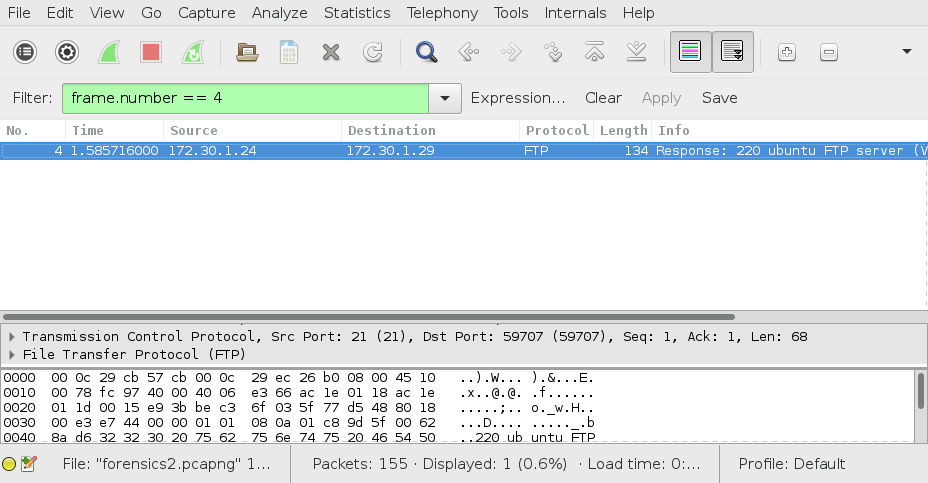
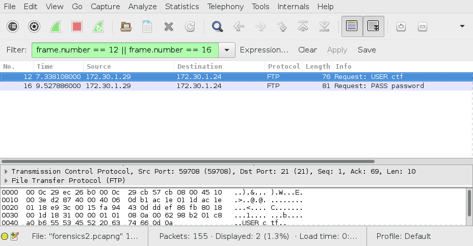
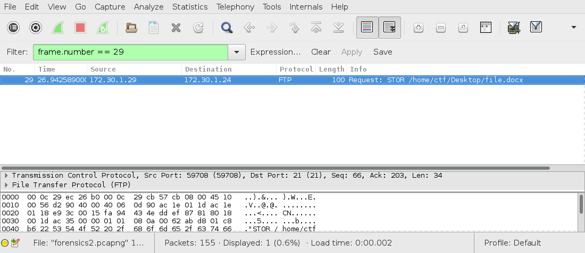
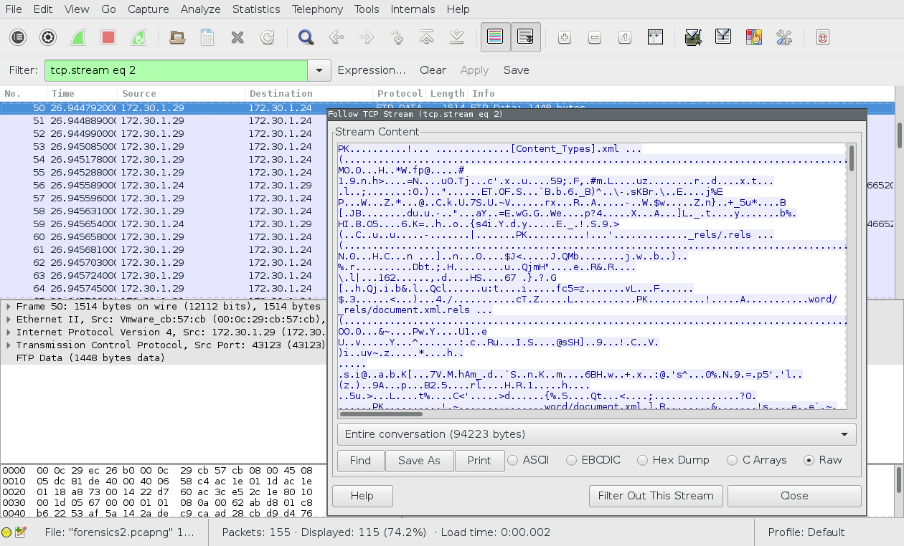
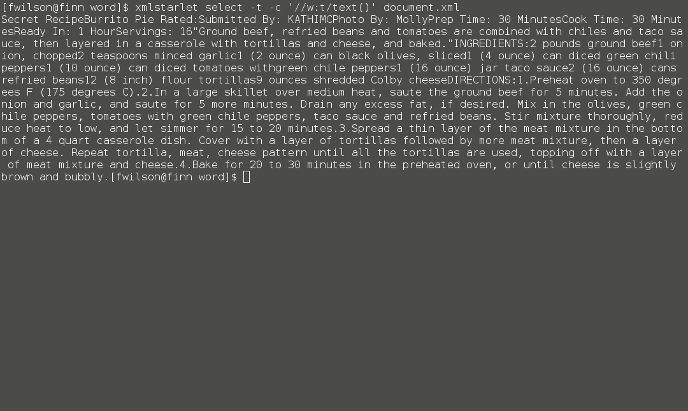

# Burritos
## Problem
We are given a packet capture and instructions to retrieve four things:
- the IP address of the FTP server that data was sent to
- the credentials used to log in to the FTP server
- the full path of the transferred file
- the name of the top secret recipe

## Process
### FTP server IP
Since this is FTP, we filtered the packets displayed to FTP only. The first
FTP packet shown (frame #4)'s source IP is the address of the server (172.30.1.24).

### FTP credentials
Frames #12 and #16 contain the username and password used to log in. The username
is `ctf` and the password is `password`.

### File path
Frame #29 contains a STOR command with the file path, which is `/home/ctf/Desktop/file.docx`.

### Recipe name
This is the most difficult part. First, we must extract the data transferred.
We filtered the packet capture to `ftp-data` and followed the stream:

We then saved the stream to a file for analysis. Since the file is a new-style Word
document (.docx format), we can simply `unzip` it (it is corrupted and cannot be
opened in Office correctly). The document text is in `word/document.xml`. In order
to extract text, we used the `xmlstarlet` command line tool with an XPath expression to
select `w:t` elements. Based on this, we found that the recipe name was "Burrito Pie".

## Solution
The flag format is `flag{[ip]_[username]_[password]_[file-path]_[recipe-name]}`.
Putting the obtained values into the format, we get: `flag{172.30.1.24_ctf_password_/home/ctf/Desktop/file.docx_Burrito-Pie}`
