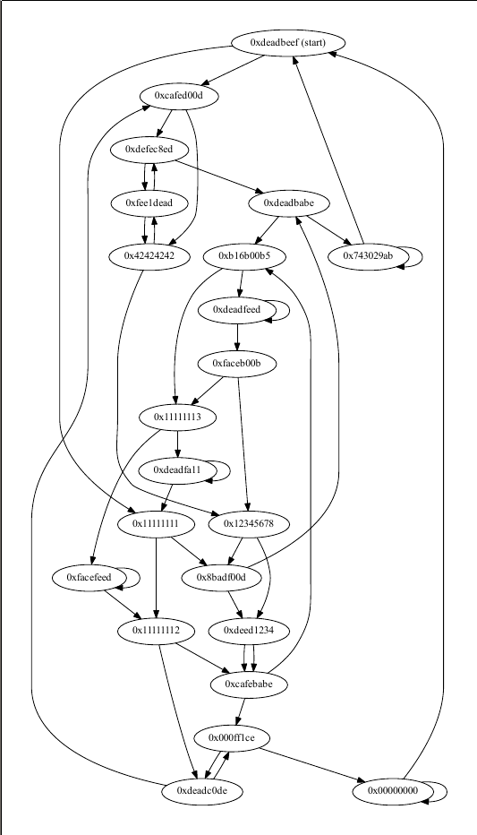
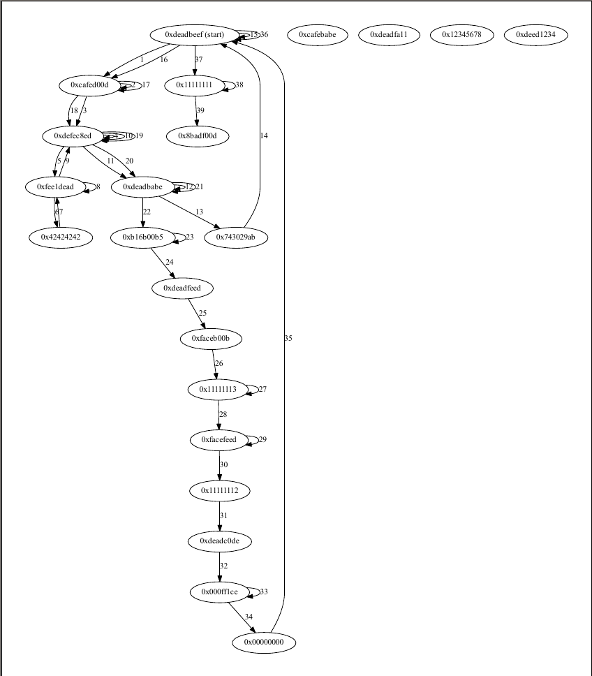

# Graphic
## Problem
We were given [a binary](400a-graphic/graphic) named graphic, and were informed it was running on 54.152.31.35 port 1337.

## Process
### Reversing
Initially, we ran the binary. Different test inputs seemed to produce mostly similar output resulting in failure:

```
samuel@samaritan ~/Downloads % ./graphic 
You stumble into Mirkwood Forest without a map.
Without any sense of direction you look around in despair as you remember these woods are littered with the unforgiving Wood Elves and giant spiders.
You begin to try different paths in hopes that one of them will lead you out of the woods.
a
You found a: deadbeef!
At the end of your journey, your value became: 0
You were eaten by spiders :c
Game Over
```

The more letters were entered, the more items we found:

```
samuel@samaritan ~/Downloads % ./graphic
You stumble into Mirkwood Forest without a map.
Without any sense of direction you look around in despair as you remember these woods are littered with the unforgiving Wood Elves and giant spiders.
You begin to try different paths in hopes that one of them will lead you out of the woods.
aa
You found a: deadbeef!
You found a: deadbeef!
At the end of your journey, your value became: -559038737
You were eaten by spiders :c
Game Over
```

Interestingly, the only item it appeared we found was `deadbeef`. `-559038737` represented as an unsigned hex value is `0xdeadbeef`:

```
>>> hex(-559038737 & 0xffffffff)                                                                                                                                                                                  
'0xdeadbeef'
```

So it was clear that the items we found definitely affected our value at the end in some way. It was obvious at this point that further reversing was required. Opening up the binary in IDA, the first thing we noticed was an interesting code section which looked like some sort of initialization (an excerpt of the assembly is shown below, [the full initialization is here](400a-graphic/init.asm)):

```
main:
0x08048711 <+35>:    lea    eax,[esp+0x24]
0x08048715 <+39>:    add    eax,0xd8
0x0804871a <+44>:    mov    DWORD PTR [esp+0x24],eax
0x0804871e <+48>:    mov    DWORD PTR [esp+0x28],0xdeadbeef
0x08048726 <+56>:    lea    eax,[esp+0x24]
0x0804872a <+60>:    add    eax,0x3c
0x0804872d <+63>:    mov    DWORD PTR [esp+0x2c],eax
```

These initialization blocks prepare the program stack by setting up what we quickly realized was a doubly linked list of possible moves in the game. Another value is also initialized before these nodes:

```
main:
0x08048709 <+27>:    mov    DWORD PTR [esp+0x20],0x764c648c
```

We realized this value (`0x764c648c`) is later compared to the end result of the game (which in our test cases was simply `0`) to determine whether or not the player made it out alive or was eaten by spiders:

```
main:
0x08048b5d <+1135>:  mov    eax,DWORD PTR [esp+0x18] ; game value
0x08048b61 <+1139>:  cmp    eax,DWORD PTR [esp+0x20] ; 0x764c648c
0x08048b65 <+1143>:  jne    0x8048b7a <main+1164>
0x08048b67 <+1145>:  mov    DWORD PTR [esp],0x8048dbb ; "You made it out alive!"
0x08048b6e <+1152>:  call   0x8048500 <puts@plt>
0x08048b73 <+1157>:  call   0x804864d <get_password> ; display flag
0x08048b78 <+1162>:  jmp    0x8048b92 <main+1188> ; exit
0x08048b7a <+1164>:  mov    DWORD PTR [esp],0x8048dd2 ; "You were eaten by spiders :c"
0x08048b81 <+1171>:  call   0x8048500 <puts@plt>
0x08048b86 <+1176>:  mov    DWORD PTR [esp],0x8048def ; "Game over"
0x08048b8d <+1183>:  call   0x8048500 <puts@plt>
```

At this point, it was clear that we somehow had to make the game value equal to `0x764c648c` to win the game. Looking at the main game loop to see how the game value is changed by moves (and what the moves are), we realized that the only characters which had an effect were "L" and "R", which we assumed moved left or right. Any other character would just move to the node the player was currently at:

```
0x08048aae <+960>:   lea    edx,[esp+0x12c]
0x08048ab5 <+967>:   mov    eax,DWORD PTR [esp+0x1c]
0x08048ab9 <+971>:   add    eax,edx
0x08048abb <+973>:   movzx  eax,BYTE PTR [eax]
0x08048abe <+976>:   cmp    al,0x4c                  ; L (move left)
0x08048ac0 <+978>:   jne    0x8048ace <main+992>
0x08048ac2 <+980>:   mov    eax,DWORD PTR [esp+0x14]
0x08048ac6 <+984>:   mov    eax,DWORD PTR [eax] ; left pointer of the node
0x08048ac8 <+986>:   mov    DWORD PTR [esp+0x14],eax ; set current node to the node "at the left"
0x08048acc <+990>:   jmp    0x8048b17 <main+1065>
0x08048ace <+992>:   lea    edx,[esp+0x12c]
0x08048ad5 <+999>:   mov    eax,DWORD PTR [esp+0x1c]
0x08048ad9 <+1003>:  add    eax,edx
0x08048adb <+1005>:  movzx  eax,BYTE PTR [eax]
0x08048ade <+1008>:  cmp    al,0x52                  ; R (move right)
0x08048ae0 <+1010>:  jne    0x8048aef <main+1025>
0x08048ae2 <+1012>:  mov    eax,DWORD PTR [esp+0x14]
0x08048ae6 <+1016>:  mov    eax,DWORD PTR [eax+0x8] ; right pointer of the node
0x08048ae9 <+1019>:  mov    DWORD PTR [esp+0x14],eax ; set current node to the node "at the right"
0x08048aed <+1023>:  jmp    0x8048b17 <main+1065>
0x08048aef <+1025>:  lea    edx,[esp+0x12c]
0x08048af6 <+1032>:  mov    eax,DWORD PTR [esp+0x1c]
0x08048afa <+1036>:  add    eax,edx
0x08048afc <+1038>:  movzx  eax,BYTE PTR [eax]
0x08048aff <+1041>:  test   al,al
0x08048b01 <+1043>:  je     0x8048b49 <main+1115>
0x08048b03 <+1045>:  lea    edx,[esp+0x12c]
0x08048b0a <+1052>:  mov    eax,DWORD PTR [esp+0x1c]
0x08048b0e <+1056>:  add    eax,edx
0x08048b10 <+1058>:  movzx  eax,BYTE PTR [eax]
0x08048b13 <+1061>:  cmp    al,0xa                  ; \n (jump to the end-of-game logic)
0x08048b15 <+1063>:  je     0x8048b49 <main+1115>
0x08048b17 <+1065>:  mov    eax,DWORD PTR [esp+0x14]
0x08048b1b <+1069>:  mov    eax,DWORD PTR [eax+0x4]
0x08048b1e <+1072>:  mov    DWORD PTR [esp+0x4],eax   ; value of current move
0x08048b22 <+1076>:  mov    DWORD PTR [esp],0x8048d73 ; "You found a: %x!\n"
0x08048b29 <+1083>:  call   0x8048490 <printf@plt>
0x08048b2e <+1088>:  mov    eax,DWORD PTR [esp+0x14]
0x08048b32 <+1092>:  mov    eax,DWORD PTR [eax+0x4]
0x08048b35 <+1095>:  xor    DWORD PTR [esp+0x18],eax ; XOR game value with node value
```

From the above logic, we determined that entering a move "L" would set the pointer to the current node to the left four bytes of the current node, and that entering a move "R" would set the pointer to the current node to the right four bytes (8 bytes from the start of the node) of the current node. At `0x08048b1e`, the 4 bytes that are 4 bytes from the start of the current node are printed out, and so we determined those 4 bytes are the node value. Below is the layout of a linked list node:

```
      4 bytes            4 bytes            4 bytes
[ left node pointer ] [ node value ] [ right node pointer ]
```

In addition, the XOR instruction at `0x08048b35` XORs the value of the current node with the game value. So, each object that is found by the game player is XOR'd with the game value to produce the final value (which, remember, has to equal `0x764c648c`. Now we're getting somewhere.

We painstakingly reversed all the possible paths armed with the knowledge of the node struct from the initialized program stack:

```
(gdb) x/100wx $esp+0x24
0xffffd274:     0xffffd34c      0xdeadbeef      0xffffd2b0      0xffffd310
0xffffd284:     0xcafebabe      0xffffd2a4      0xffffd2a4      0xdeadbabe
0xffffd294:     0xffffd328      0xffffd28c      0x8badf00d      0xffffd334
0xffffd2a4:     0xffffd2e0      0xb16b00b5      0xffffd364      0xffffd2d4
0xffffd2b4:     0xcafed00d      0xffffd370      0xffffd2b0      0xdeadc0de
0xffffd2c4:     0xffffd310      0xffffd2c8      0xdeadfa11      0xffffd34c
0xffffd2d4:     0xffffd2ec      0xdefec8ed      0xffffd28c      0xffffd2f8
0xffffd2e4:     0xdeadfeed      0xffffd2e0      0xffffd370      0xfee1dead
0xffffd2f4:     0xffffd2d4      0xffffd364      0xfaceb00b      0xffffd31c
0xffffd304:     0xffffd358      0xfacefeed      0xffffd304      0xffffd340
0xffffd314:     0x000ff1ce      0xffffd2bc      0xffffd334      0x12345678
0xffffd324:     0xffffd298      0xffffd328      0x743029ab      0xffffd274
0xffffd334:     0xffffd280      0xdeed1234      0xffffd280      0xffffd274
0xffffd344:     0x00000000      0xffffd340      0xffffd298      0x11111111
0xffffd354:     0xffffd358      0xffffd2bc      0x11111112      0xffffd280
0xffffd364:     0xffffd304      0x11111113      0xffffd2c8      0xffffd31c
0xffffd374:     0x42424242      0xffffd2ec      0xf7fd63b0      0xf7f83000
```

We visualized the possible paths using graphviz:



In text form for easier translation and with the edge directions labeled:

```
Value: 0xdeadbeef
   Left: 0x11111111
   Right: 0xcafed00d
Value: 0xcafebabe
   Left: 0xff1ce
   Right: 0xb16b00b5
Value: 0xdeadbabe
   Left: 0xb16b00b5
   Right: 0x743029ab
Value: 0x8badf00d
   Left: 0xdeadbabe
   Right: 0xdeed1234
Value: 0xb16b00b5
   Left: 0xdeadfeed
   Right: 0x11111113
Value: 0xcafed00d
   Left: 0xdefec8ed
   Right: 0x42424242
Value: 0xdeadc0de
   Left: 0xcafed00d
   Right: 0xff1ce
Value: 0xdeadfa11
   Left: 0xdeadfa11
   Right: 0x11111111
Value: 0xdefec8ed
   Left: 0xfee1dead
   Right: 0xdeadbabe
Value: 0xdeadfeed
   Left: 0xfaceb00b
   Right: 0xdeadfeed
Value: 0xfee1dead
   Left: 0x42424242
   Right: 0xdefec8ed
Value: 0xfaceb00b
   Left: 0x11111113
   Right: 0x12345678
Value: 0xfacefeed
   Left: 0x11111112
   Right: 0xfacefeed
Value: 0xff1ce
   Left: 0x0
   Right: 0xdeadc0de
Value: 0x12345678
   Left: 0xdeed1234
   Right: 0x8badf00d
Value: 0x743029ab
   Left: 0x743029ab
   Right: 0xdeadbeef
Value: 0xdeed1234
   Left: 0xcafebabe
   Right: 0xcafebabe
Value: 0x0
   Left: 0xdeadbeef
   Right: 0x0
Value: 0x11111111
   Left: 0x8badf00d
   Right: 0x11111112
Value: 0x11111112
   Left: 0xdeadc0de
   Right: 0xcafebabe
Value: 0x11111113
   Left: 0xfacefeed
   Right: 0xdeadfa11
Value: 0x42424242
   Left: 0x12345678
   Right: 0xfee1dead
```

The next step was to find a path (starting at `0xdeadbeef`) which, when each step was XOR'd with the game value (which starts as `0xdeadbeef` because it is the first node) produced the target value `0x764c648c`. It is important to mention that any step can essentially be negated by visiting a node and then visiting itself again (because any move other than L or R visits the current node again). This is because `X xor X == 0` by the properties of XOR.

### Finding the path
(fill in finding the set)

Once we now had a set of values which when XOR'd together produced the target value (`['0x8badf00d', '0xdeadc0de', '0xdeadfeed', '0xfee1dead', '0xfaceb00b', '0x743029ab', '0x11111112', '0x42424242']`), the next step was to translate that to a valid path in the program, remembering that any step in the path could be negated by visiting it twice. We used good old pencil and the graph previously mentioned to trace out a reasonably efficient path:



This was then translated into the following solution using the above text mapping between nodes (keep in mind that X has no effect but to revisit the current node):

```
RXLXLLRXRXRXRRXRXLXRXLXLLLXLXLLRXLLXLXL
```

## Solution
We connected to the game server (whose address and port we were given) using netcat, and gave the solution we found to get the flag, `flag{th3r3_and_b4ck_again}`:

```
You stumble into Mirkwood Forest without a map.
Without any sense of direction you look around in despair as you remember these woods are littered with the unforgiving Wood Elves and giant spiders.
You begin to try different paths in hopes that one of them will lead you out of the woods.
RXLXLLRXRXRXRRXRXLXRXLXLLLXLXLLRXLLXLXL
You found a: cafed00d!
You found a: cafed00d!
You found a: defec8ed!
You found a: defec8ed!
You found a: fee1dead!
You found a: 42424242!
You found a: fee1dead!
You found a: fee1dead!
You found a: defec8ed!
You found a: defec8ed!
You found a: deadbabe!
You found a: deadbabe!
You found a: 743029ab!
You found a: deadbeef!
You found a: deadbeef!
You found a: cafed00d!
You found a: cafed00d!
You found a: defec8ed!
You found a: defec8ed!
You found a: deadbabe!
You found a: deadbabe!
You found a: b16b00b5!
You found a: b16b00b5!
You found a: deadfeed!
You found a: faceb00b!
You found a: 11111113!
You found a: 11111113!
You found a: facefeed!
You found a: facefeed!
You found a: 11111112!
You found a: deadc0de!
You found a: ff1ce!
You found a: ff1ce!
You found a: 0!
You found a: deadbeef!
You found a: deadbeef!
You found a: 11111111!
You found a: 11111111!
You found a: 8badf00d!
At the end of your journey, your value became: 1984717964
You made it out alive!
flag{th3r3_and_b4ck_again}
```
