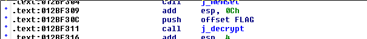
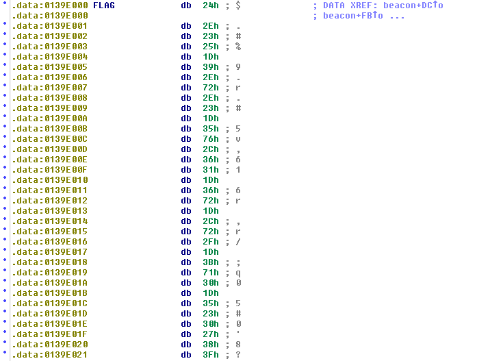
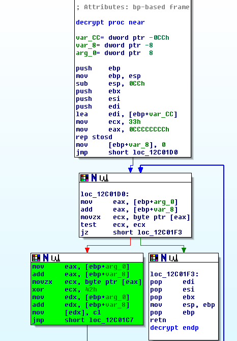

# Malrio Ware
## Problem
We are given a zip file containing a [PE executable](500a-malrio-ware/lola.exe) and a [PDB file](500a-malrio-ware/lola.pdb).

## Process
The first step in our process was to run the executable we were given (in a VM, of course; always practice safe CTFing). When run, the executable deletes itself, backgrounds its process, and then launches a photo of a [very cute puppy](500a-malrio-ware/puppy.png) approximately every 10 seconds. No other effects were immediately visible. The program also adds itself as a startup task so it will be preserved across reboots.

Opening up the binary in IDA and looking at the main function, we quickly noticed a suspicious offset "FLAG" and a function "decrypt": 



The data at offset FLAG is `'\x24\x2e\x23\x25\x1d\x39\x2e\x72\x2e\x23\x1d\x35\x76\x2c\x36\x31\x1d\x36\x72\x1d\x2c\x72\x2f\x1d\x3b\x71\x30\x1d\x35\x23\x30\x27\x38\x3f'` (in Python hex format):



Reversing the decrypt function, there is some initialization done and some other unimportant logic in the first two blocks below, and then the green block performs an xor decryption loop by xoring the data at offset FLAG with the hex byte `0x42`:



At this point, we had all information needed to obtain the flag.

## Solution
Using pwnlib's xor function to xor the data at FLAG with 0x42 ourselves, we obtained the flag:

```
>>> xor('\x24\x2e\x23\x25\x1d\x39\x2e\x72\x2e\x23\x1d\x35\x76\x2c\x36\x31\x1d\x36\x72\x1d\x2c\x72\x2f\x1d\x3b\x71\x30\x1d\x35\x23\x30\x27\x38\x3f','\x42')
'flag_{l0la_w4nts_t0_n0m_y3r_warez}'
```
