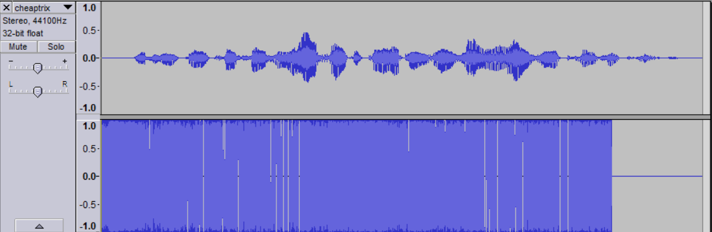

# Cheaptrix
## Problem
We are given an audio file which seems to consist solely of Gandalf raging about
cheap tricks.

## Process
We opened the file in Audacity and noticed that the Gandalf audio was only on the
right channel:

Muting the right channel and playing only the left channel gave us
a spoken flag. (Note well: because of the equals signs at the end of the audio, we
initially thought this was a Base64 encoded message. It was not.)

## Solution
The flag is the text the speaker on the left channel of the audio is saying. The
flag is `wkq3vlhbodeyra==`.
