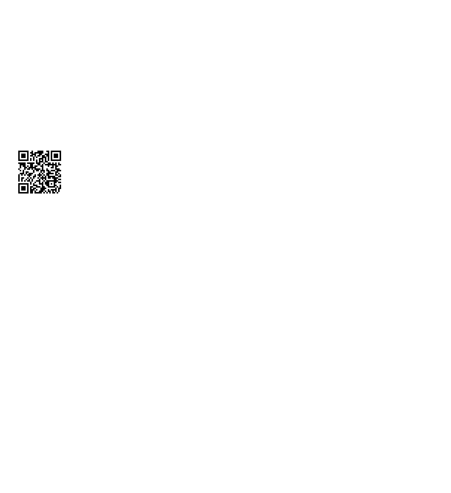

# What's The Difference [(Asciicast)](https://asciinema.org/a/4o3l19jen3ei5lkzvem5lcbyg)
## Problem
We are given a zip file with a PNG image inside.

## Process
Given the problem name, we assume we are trying to compare the image given with
some other image. No other image or file was given inside the zip, so we ran `binwalk`
on the image. `binwalk` found and extracted another image at address `DF93D5`. We
wrote [a quick Python script](500a-whats-the-difference/script.py) to find the difference
between these two images and output it as a new image. The output is shown below.

Looking at our resultant difference image, we see a QR code. Isolating this QR code
and using [an online decoder](http://zxing.org) gives us the flag.

## Solution
The flag is the text encoded in the QR code that is the difference of the image given
and another image embedded within that image; `flag{steganography_is_the_bane_of_my_existance}`.
