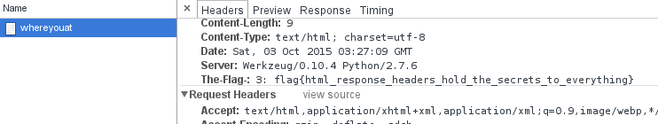

# What's Good?
## Problem
We are given a link to a web server. Clicking on the link reveals a GeoCities-esque
page.

## Process
Looking at the source of the page, there is a link to one other page `/whereyouat`.
This page seems unhelpful at first, but looking at the network requests in Chrome's
Developer Console shows a response header `The-Flag`. Not surprisingly, it is the
flag.

## Solution
The solution is the value of the header without the `flag{}` boilerplate:
`html_response_headers_hold_the_secrets_to_everything`
